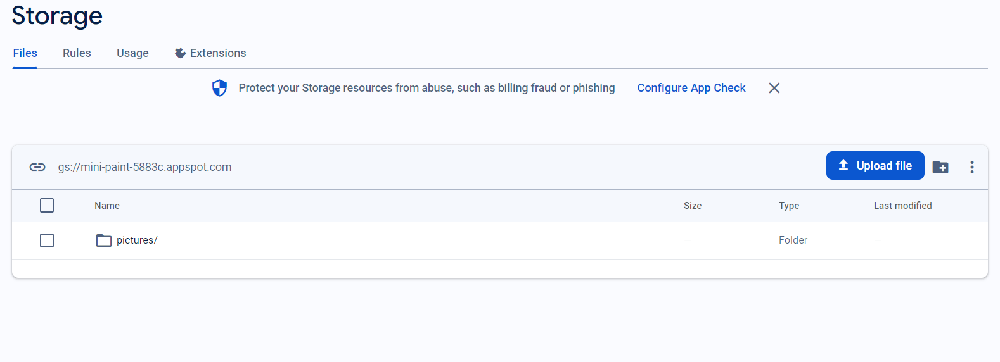
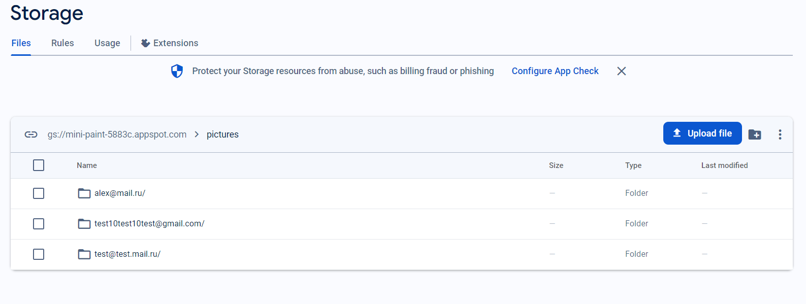
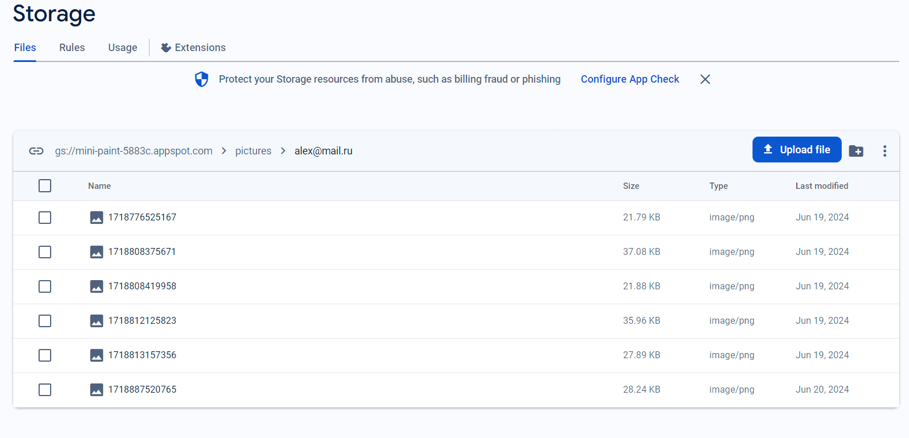

# innowise-lab-internship-level-2-mini-paint

<h1>Innowise lab internship level 2 Mini Paint</h1>

<h2>1. Link to the task</h2>

https://drive.google.com/file/d/19cb4whI_HUVPzuaPyaj5r6hGotIVnhho/view

<h2>2. How to run the app</h2>

- `git clone https://github.com/AlekseyYuriev/innowise-lab-internship-level-2-mini-paint.git` - clone the repository (HTTPS)
- `npm install` - install the dependencies
- `npm run dev` - run the app

<h2>3. Database snapshot</h2>
All saved images are sent to storage. The storage structure in firebase is organized the following way:

<h2>4. Application stack and description of the file structure</h2>

The App is a Vue 3 based application. It was created using composition API. The App includes several additional libraries:

- Vue Router for routing
- Pinia - officially recommended state management library
- Vuelidate for form validation
- Firebase - as a backend of the app

The App has the following file structure:

1. In the <strong>root</strong> folder you can find files that are used to configure and develop the app and <strong>index.html</strong> file.
    
2. <strong>src</strong> folder contains the files of the app including <strong>main.js, App.vue</strong> and several folders:

- `assets` - folder with basic CSS files and svg icons
- `components` - folder with Vue Components of the App
- `composables` - folder with composables functions responsible for the logic of mini paint
- `firebase` - folder with firebase configuration file
- `router` - folder with Vue Router configuration file
- `services` - folder with the file responsible for requests to Firebase
- `store` - folder with Pinia storage configuration file
- `views` - folder with the pages of the App

<h2>5. Link to the deployed app</h2>

https://mini-paint-5883c.web.app
